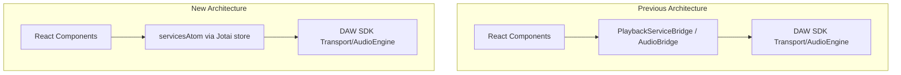

# Branch Analysis: refactor/daw-sdk

## Summary of Changes

This branch removes the bridge layer between React components and the DAW SDK, replacing it with a unified Jotai atom-based service registry pattern.**Files changed:** 42 files, +3579 / -1555 lines

### Architecture Changes




### Key Changes

1. **Deleted Files (bridges layer removed)**:

- [`packages/daw-react/src/bridges/playback-bridge.ts`](packages/daw-react/src/bridges/playback-bridge.ts)
- [`packages/daw-react/src/bridges/audio-bridge.ts`](packages/daw-react/src/bridges/audio-bridge.ts)
- [`packages/daw-react/src/bridges/index.ts`](packages/daw-react/src/bridges/index.ts)
- [`packages/daw-react/src/hooks/use-bridge-mutations.ts`](packages/daw-react/src/hooks/use-bridge-mutations.ts)
- [`packages/daw-react/src/atoms/machines/drag-machine.ts`](packages/daw-react/src/atoms/machines/drag-machine.ts)

2. **Service Registry Migration** ([`service-registry.ts`](packages/daw-react/src/atoms/service-registry.ts)):

- Changed from global mutable `serviceRegistry` object to `servicesAtom` (Jotai atom)
- SSR-safe: no global state pollution
- Services accessed via `get(servicesAtom)` in atoms

3. **DAW Provider Refactor** ([`daw-provider.tsx`](packages/daw-react/src/providers/daw-provider.tsx)):

- Creates service wrappers directly from SDK (lines 71-186)
- Registers to both `servicesAtom` and legacy `serviceRegistry` for backwards compatibility
- Unit conversion: SDK Transport uses ms, callbacks expect seconds

4. **Tracks Atom Migration** ([`tracks.ts`](packages/daw-react/src/atoms/tracks.ts)):

- All `serviceRegistry.playbackService` calls → `get(servicesAtom).playbackService`
- Pattern consistently applied across `addTrackAtom`, `updateTrackAtom`, `loadAudioFileAtom`, etc.

5. **Automation System Enhancement** ([`automation.ts`](packages/daw-sdk/src/utils/automation.ts)):

- New helpers: `interpolateEnvelopeValue()`, `generateSegmentCurveValues()`
- Transport now uses these helpers for cleaner automation scheduling

6. **DAWTrackContent Performance** ([`daw-track-content.tsx`](apps/web/components/daw/panels/daw-track-content.tsx)):

- Added custom `trackRowPropsAreEqual` comparator for memo
- New `DragPreviewOverlay` isolated component
- Switched to `useTrackInteractionActions()` (actions-only, no subscriptions)
- Imperative store reads via `store.get()` in effects

---

## Critique

### Positives

1. **Cleaner Architecture**: Removing the bridge layer reduces indirection. SDK services now wrapped inline in provider.
2. **SSR-Safe**: `servicesAtom` avoids global mutable state pollution.
3. **Performance Optimizations**: 

- `trackRowPropsAreEqual` custom comparator prevents unnecessary clip re-renders
- `useTrackInteractionActions()` splits subscriptions from actions
- Store subscriptions via `store.sub()` avoid component re-renders

4. **Automation Helpers**: Extracted `interpolateEnvelopeValue` and `generateSegmentCurveValues` are reusable and testable.	

### Concerns / Issues

1. **Incomplete Migration - STALE COMMENT**:

- Line 1151 in [`daw-track-content.tsx`](apps/web/components/daw/panels/daw-track-content.tsx) references `serviceRegistry.playbackService` in a comment:
     ```typescript
                              // updateClipAtom internally calls serviceRegistry.playbackService.synchronizeTracks()
     ```


- The actual code migrated, but comment is outdated. Minor issue, but indicates rushed migration.

2. **Dual Registration Pattern**:

- [`daw-provider.tsx`](packages/daw-react/src/providers/daw-provider.tsx) lines 191-201 register to BOTH `servicesAtom` AND `serviceRegistry`
- Comment says "Legacy registration (deprecated, will be removed)" but consumers exist
- Risk: If cleanup order matters, could cause stale references

3. **Import Still Present** in [`daw-track-content.tsx`](apps/web/components/daw/panels/daw-track-content.tsx):
   ```typescript
                  import { servicesAtom } from "@wav0/daw-react"
   ```


But `servicesAtom` is not used directly in this file - only `serviceRegistry` reference in a comment. The import is dead code.

4. **Potential Race Condition in `safeSet`**:

- [`playback.ts`](packages/daw-react/src/atoms/playback.ts) lines 22-40: `safeSet` catches errors and marks `state.disposed = true`
- If atom setter fails transiently (e.g., React concurrent mode), the state is permanently marked disposed
- No recovery mechanism

5. **Debounce Timing in Playback End Handler**:

- 50ms debounce in provider (line 124) to avoid false positives from stop→play cycles
- If SDK introduces longer internal cycles, this could fire prematurely
- Not a bug now, but fragile coupling to SDK internals

---

## Vulnerabilities / Bugs

### 1. Stale Comment (Low Priority)

**File:** `apps/web/components/daw/panels/daw-track-content.tsx` line 1151Comment references old `serviceRegistry` pattern but actual code uses `servicesAtom`.**Fix:** Update comment to reflect `servicesAtom` pattern.

### 3. No Critical Security Vulnerabilities

The changes are internal refactoring with no new attack surface:

- No new network calls
- No user input handling changes
- No authentication changes
- File storage (OPFS) patterns unchanged

### 4. Potential Memory Leak Risk (Low-Medium)

**File:** [`packages/daw-react/src/providers/daw-provider.tsx`](packages/daw-react/src/providers/daw-provider.tsx)The cleanup function inside `createPlaybackSession` (lines 184-198) creates event listener closures. If `restartPlaybackRef.current` is called rapidly during loop restart sequences, closures could accumulate before garbage collection.**Not a bug yet** - the debouncing handles this, but worth monitoring.---

## Recommendations

1. **Fix stale comment**: Update `serviceRegistry` reference in comment at line 1151 of `daw-track-content.tsx`
2. **Add TODO to remove legacy dual-registration** once migration is verified complete
3. **Consider adding a test** for the 50ms debounce behavior to prevent regression if SDK timing changes